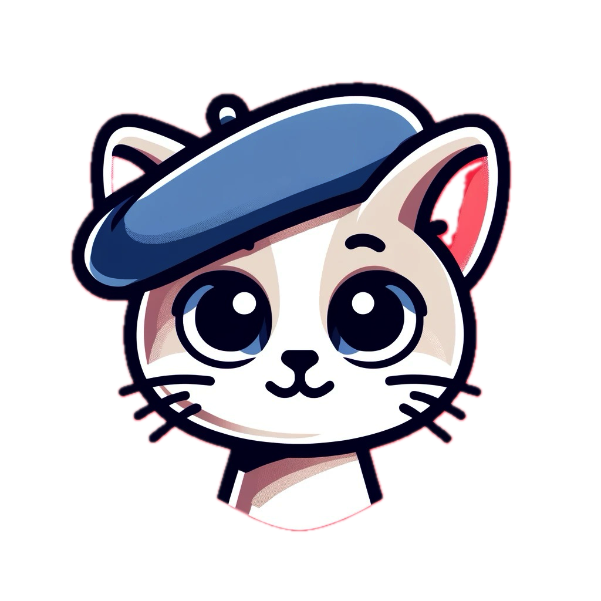
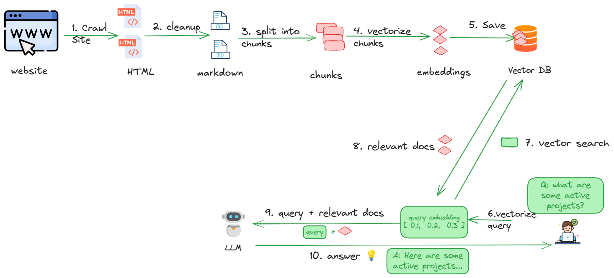

# AllyCat

**AllyCat** is full stack, open source chatbot that uses GenAI LLMs to answer questions about your website. It is simple by design and will run on your laptop or server. 

## Why?

AllyCat is purposefully simple so it can be used by developers to learn how RAG-based GenAI works. Yet it is powerful enough to use with your website, You may also extend it for your own purposes. 

⭐ **Found this tool helpful? Give it a star on GitHub to support the project and help others discover it!**

**🗞️ [Allycat news](news.md)** - releases and new features!

## How does it work? 
AllyCat uses your choice of LLM and vector database to implement a chatbot written in Python using [RAG](https://en.wikipedia.org/wiki/Retrieval-augmented_generation) architecture.
AllyCat also includes web scraping tools that extract data from your website (or any website). 

## 🌟🌟 Features 🌟🌟 

1. Web crawler to download content from website
2. HTML processing/cleanup, text extraction and conversion to markdown. Uses [Docling](https://github.com/docling-project/docling)
3. Chunking, vector embedding creation, saving to vector database.  Uses [Llama Index](https://docs.llamaindex.ai/en/stable/) and [Granite Embedding Model](https://huggingface.co/ibm-granite/granite-embedding-30m-english)
4. Supports multiple vector databases. [Milvus](https://milvus.io/) or [Weaviate](https://weaviate.io)
5. Use local LLMs using [Ollama](https://ollama.com/) or use any inference service.  Uses [LiteLLM](https://www.litellm.ai/)
6. Chatbot with interface to answer questions with text scraped from a website.
7. End User and New Contributor Friendly.

## ⚡️⚡️Quickstart ⚡️⚡️

You can run allycat in following settings:

| Setup                                              | Stack                             | Description                                   |
|----------------------------------------------------|-----------------------------------|-----------------------------------------------|
| [RAG (local) 1](rag-local-milvus-ollama/README.md) | Milvus (DB) + Ollama (LLMs)       | Everything runs locally.  No API keys needed. |

<!-- 
| [Graph RAG local](#)                               | Neo4J (db) + Ollama (LLMs)        | Everything runs locally.  No API keys needed. |
| [Graph RAG remote 1](#)                            | Neo4J (db) + Inference  providers | Services run on the cloud                     | 
-->

<!-- 
### Option 1: Use the Docker image

A great option for a quick evaluation.  
See [running AllyCat using docker](docs/running-in-docker.md)

### Option 2: Run natively (for tweaking, developing)

Choose this option if you want to tweak AllyCat to fit your needs. For example, experimenting with embedding models or LLMs.  
See [running AllyCat natively](docs/running-natively.md) 
-->

## AllyCat Workflow

See [running allycat](docs/running-allycat.md)

## Customizing AllyCat

See [customizing allycat](docs/customizing-allycat.md)

## Deploying AllyCat

See [deployment guide](docs/deploy.md)

## Developing AllyCat

See [developing allycat](docs/developing-allycat.md)

## Why the name **AllyCat**?

Originally AllianceChat, we shortened it to AllyCat when we learned chat means cat in French. Who doesn't love cats?!

