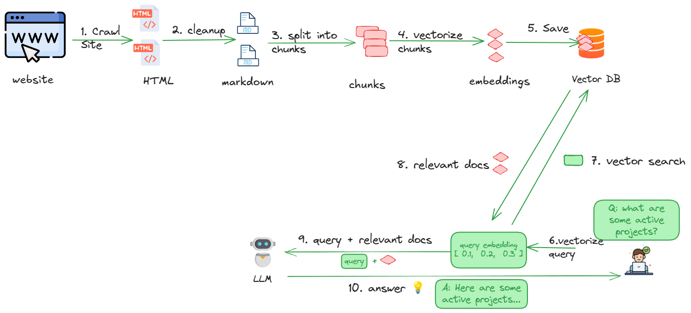

# Allycat Local RAG 

This setup runs every thing locally.  No API keys required.

## Tech Stack

| Component        | Functionality |
|------------------|---------------|
| [Milvus](https://milvus.io/) embedded | Vector db     |
| [Ollama](https://ollama.com/)            | LLM runtime   |


## Step-1: Clone this repo

```bash
# Substitute appropriate repo URL
git   clone https://github.com/The-AI-Alliance/allycat/
cd    allycat/rag-local-milvus-ollama
```

---

## Step-2: Setup Python Dev Env

[Setup python dev env](../docs/setup-python-env.md)

---

## Step-3: Setup `.env` file

**This step is optional**.  Allycat runs fine with default configuration options.  You can customize them to fit your needs.

A sample `env.sample.txt` is provided.  Copy this file into `.env` file.

```bash
cp  env.sample.txt  .env
```

And edit `.env` file to make your changes.

Note: Allycat will work fine without an `.env` file

---

## Allycat Workflow



## Step-4: Crawl the website


This step will crawl a site and download the website content into the `workspace/crawled` directory

code: [../common/1_crawl_site.py](../common/1_crawl_site.py)


```bash
# default settings
python     ../common/1_crawl_site.py  --url https://thealliance.ai
# or specify parameters
python  ../commom/1_crawl_site.py   --url https://thealliance.ai --max-downloads 100 --max-depth 5
```

## Step-5: Process Downloaded files

We will process the downloaded files (html / pdf) and extract the text as markdown.  The output will be saved in the`workspace/processed` directory in markdown format

We use [Docling](https://github.com/docling-project/docling) to process downloaded files.  It will convert the files into markdown format for easy digestion.

- Use python script: [../common/2_process_files.py](../common/2_process_files.py)
- or (For debugging) Run notebook :  [../common/2_process_files.ipynb](../common/2_process_files.ipynb)  

```bash
python   ../common/2_process_files.py
```

---

## Step-6: Save data into Milvus Vector DB

In this step we:

- create chunks from cleaned documents
- create embeddings (embedding models may be downloaded at runtime)
- save the chunks + embeddings into a vector database

We currently use [Milvus](https://milvus.io/) as the vector database.  We use the embedded version, so there is no setup required!


- Run python script [3_save_to_vector_db.py](3_save_to_vector_db.py)
- or (For debugging) Run the notebook [3_save_to_vector_db.ipynb](3_save_to_vector_db.ipynb)  

```bash
python   3_save_to_vector_db.py
```

---

## Step 7: Run Ollama

For the next step (query) we will be using an LLM running locally on Ollama.

- If you are running the Allycat docker image, then Ollama is already installed.  
- If you running natively on your machine, make sure to install Ollama by following the [setup instructions here](https://docs.ollama.com/)

Once Ollama is installed, we just need to download the model we are going to be using.

Here is how:

```bash
# download the model
ollama   pull qwen3:0.6b
ollama   pull gemma3:1b

# verify the model is available locally
ollama  list
```

Start Ollama server by 

```bash
ollama serve
```

And configure the model to use in .env file.

```python
# LLM_MODEL = 'ollama/gemma3:1b'
LLM_MODEL = 'ollamaqwen3:0.6b'
```


## Step-8: Query documents

- running python script: [4_query.py](4_query.py)
- or (for debug) using notebook [4_query.ipynb](4_query.ipynb)

```bash
python  4_query.py
```

---

## Dev Notes

### Creating `requirements.txt` using uv

```bash
uv export --frozen --no-hashes --no-emit-project --no-default-groups --output-file=requirements.txt
```