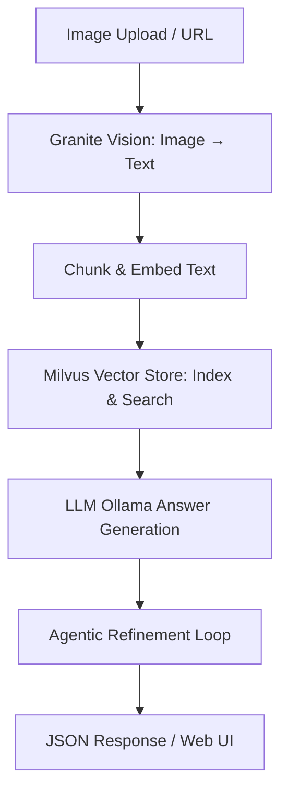

# Multimodal Vision+Text RAG Service

## Overview
This service provides a **full multimodal RAG (Retrieval-Augmented Generation) pipeline** for analyzing images, converting them to text, indexing into a vector database, and generating context-aware answers using an LLM. It’s designed for **plant diagnostics**, but the pipeline is fully generalizable to other vision+text tasks.

Key features:
- Image-to-text via **Granite Vision** (Replicate)
- Chunking and embedding using **SentenceTransformers**
- Retrieval via **Milvus vector store**
- Context-aware LLM generation with **Ollama**, including **agentic refinement**
- FastAPI endpoints for file upload or image URL
- Structured JSON responses with retrieval trace

---

## Architecture




## Prerequisites
- WSL: Ubuntu is needed on a Windows OS to use Milvus.
- Python 3.10+
- Docker & docker-compose (for Milvus)
- Replicate API Token
- .env file containing:
    * REPLICATE_API_TOKEN=your_token_here
    * MILVUS_HOST=localhost
    * MILVUS_PORT=19530
    * OLLAMA_HOST=http://localhost:11434
    * OLLAMA_MODEL=gemma3:1b
    * EMBED_MODEL_NAME=all-MiniLM-L6-v2

## Installation

# Setup and activate your environment

    ```bash
    ## if using uv
    source .venv/bin/activate

    ## if using python venv
    source  .venv/bin/activate

    ## If using conda
    conda  activate  allycat-1  # what ever the name of the env
    ```
# Install dependancies
pip install -r requirements.txt

# Start Milvus vector database
docker compose up -d

# Pull Ollama model
ollama pull gemma3:1b

# Run the FastAPI UI
uvicorn vision+text_rag_model:app

# Open browser at http://localhost:8000 or use the /analyze endpoint
curl -X POST "http://localhost:8000/analyze" \
-F "file=@/path/to/image.jpg" \
-F "user_query=Identify plant and disease" \
-F "prompt_text=<Describe the plants appearance here.>"

# Highlights
- Enterprise-grade modular design
- Full RAG pipeline with multimodal input
- Iterative LLM refinement for more reliable answers
- Easily extensible to other domains


