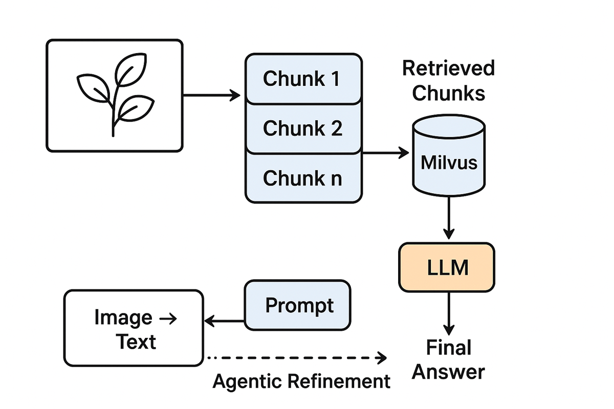
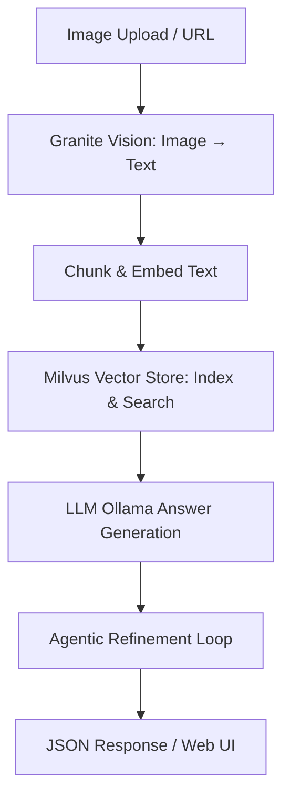
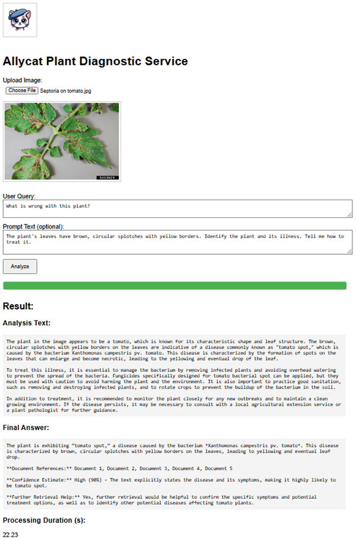

# Multimodal Vision + Text RAG Service

A production-style **multimodal RAG pipeline** that processes images, converts them to text, retrieves relevant context using Milvus, and generates grounded answers using an LLM. Originally built for **plant diagnostics**, but fully generalizable to any Vision + Text system.

---

## Features

- Image-to-text via **Granite Vision** (via Replicate)
- Chunking and embedding using **SentenceTransformers**
- Vector search using **Milvus**
- LLM answer generation with **Ollama**
- FastAPI service with file upload
- Structured JSON output with retrieval traceability
- Modular, production-oriented architecture

---

## Architecture

### High-Level Diagram


### Detailed Flow


---

## Prerequisites
- **WSL: Ubuntu** (required for Milvus on Windows)
- **Python 3.10+**
- **Docker & docker-compose**
- **Replicate API Token**
- A '.env' file with:

```
REPLICATE_API_TOKEN=your_token_here
MILVUS_HOST=localhost
MILVUS_PORT=19530
OLLAMA_HOST=http://localhost:11434
OLLAMA_MODEL=gemma3:1b
EMBED_MODEL_NAME=all-MiniLM-L6-v2
```

---

## Installation

### 1. Create and activate an environment

```bash
# Using uv
source .venv/bin/activate

## Using python venv
python3 -m venv .venv
source  .venv/bin/activate

## Using conda
conda  activate  allycat-1  # what ever the name of the env
```

### 2. Install dependancies
```bash
pip install -r requirements.txt
```

### 3. Start Milvus
```
docker compose up -d
```

### 4. Pull the Ollama model
```bash
ollama pull gemma3:1b
```

### 5. Run the FastAPI UI
```bash
uvicorn vision+text_rag_model:app
```

Open your browser:
http://localhost:8000

---

### FastAPI UI Preview


## Highlights
- Modular, production-ready design
- Full multimodal RAG flow (Vision -> Retrieval -> LLM -> Refinement)
- Includes both API endpoints and web-based interface
- Easily extensible for any visual domain
- Developer-friendly structure with clear component boundaries

---

## License

This project is licensed under the [MIT License](LICENSE) 

---

## Future Work
- Add GPU acceleration support
- Add batch ingestion for large image datasets
- Integrate LiteLLM or enterprise gateways
- Add monitoring & observability hooks
- Deploy to Kubernetes (Helm chart + manifests)


